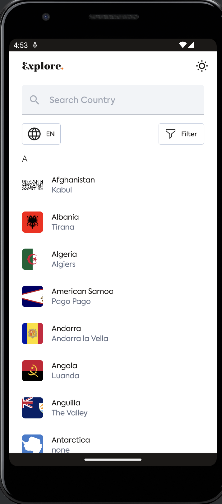
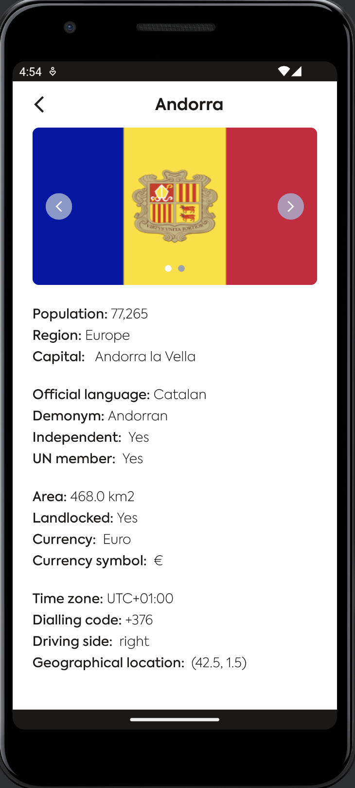
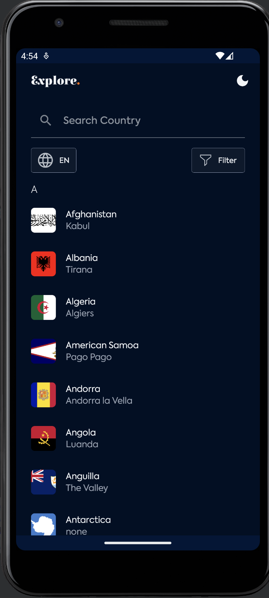

<h1> Explore</h1>
Explore is an android project built with jetpack compose that displays the list of countries and details about each country. The data of the list of countries 
with their details was gotten from the <a href="https://restcountries.com/#rest-countries" target="_blank">rest coutries api</a>. 

This project was developed for HNG 9 Mobile Track Stage 3 Task.

## Features of the app
* Shows a list of Countries and ountry detail
* Search and Filter list of countries by continent and timezone.
* Dark Mode

## App Architecture
For this project, I wanted to apply some common app architecture principles which are seperation of concerns, driving UI from data models and single source of truth.

The project was built this way so that if there are new features to be added it will not be too complicated to implement them. the layers of the app are:
*  UI layer
*  Domain layer
*  Data Layer

The UI Layer - The role of the UI is to display the application data on the screen and also to serve as the primary point of user interaction. Whenever the data changes, either due to user interaction (like pressing a button) or external input (like a network response), the UI should update to reflect those changes. Effectively, the UI is a visual representation of the application state as retrieved from the data layer.

The Domain Layer - The domain layer is responsible for encapsulating complex business logic, or simple business logic that is reused by multiple ViewModels. This layer is optional because not all apps will have these requirements. You should only use it when needed-for example, to handle complexity or favor reusability.

The Data Layer - While the UI layer contains UI-related state and UI logic, the data layer contains application data and business logic. The business logic is what gives value to your app—it's made of real-world business rules that determine how application data must be created, stored, and changed.

## Design
For this project we were provided a mobile app design to implement <a href="https://www.figma.com/file/v9AXj4VZNnx26fTthrPbhX/Explore?node-id=14%3A261&t=jSSUmgBSOe4WAUb6-1" target="_blank">Figma link</a>. 

##  Libraries and Components

The project leverages the following components and libraries :
*  [Jetpack Compose](https://developer.android.com/jetpack/compose) - used to build the UI components.
*  [Compose Destinations](https://composedestinations.rafaelcosta.xyz/) - used for compose navigation.
*  [ViewModel](https://developer.android.com/reference/androidx/lifecycle/ViewModel) - UI related data holder, lifecycle aware.
*  [Retrofit](https://square.github.io/retrofit/) - to make api calls to an HTTP web service.
*  [Gson](https://github.com/square/retrofit/tree/master/retrofit-converters/gson) - which handles the deserialization of the returned JSON to Kotlin data objects. 
*  [Coil](https://coil-kt.github.io/coil/compose/) - to load and cache images by URL.
*  [Accompanist](https://github.com/google/accompanist) - group of libraries that aim to supplement Jetpack Compose with features that are commonly required by developers but not yet available.
*  [Hilt](https://developer.android.com/training/dependency-injection/hilt-android) - Hilt is a dependency injection library for Android that reduces the boilerplate of doing manual dependency injection in your project.

## Prerequisites
You need the following requirements to run this project
*   Android Studio IDE Dolphin 2021.3.1 Patch 1
*   Compose 1.2.1
*   Android SDK v33
*   Kotlin version 1.7.20
*   Gradle 7.2.2

To run this project
* Download this code and import the project on Android Studio. <a href="https://www.youtube.com/watch?v=hPEjSymSV4s" target="_blank">Video tutorial</a>

## Try out the app
You can test the app on appetize.io 
* [Link](https://appetize.io/app/fcla3xjtc6ack3yqrmymtjv5hu)

## Download App APK
* [Download](https://github.com/t2dbabz/Explore/raw/main/app/release/Explore.apk)

## Challenges
During the development the app, i faced a few challenges. some of the challenges where

* Implementing the search and filter country list by continent and timezone.
* Finding the what was causing the app crash when getting the api response.
* Implementing some of the UI components based on the design.

## Features I would like to Implement
* Changinng app language based on the user preference.
* offline cache
* open country map on a map app when the map link is clicked

## Screenshots
<table>
    <tr>
    <td>Countries list Screen</td>
      <td>Country Details Screen</td>
    <td>Dark Mode</td>
  </tr>
   <tr>
    <td></td>
    <td></td>
    <td></td>
  </tr>
  </table>
